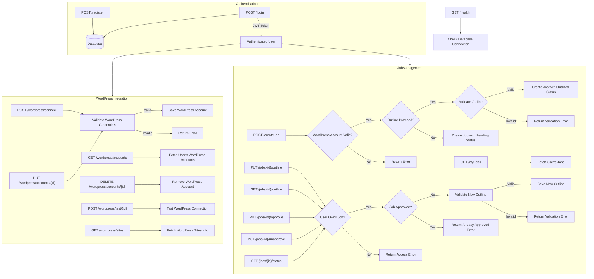
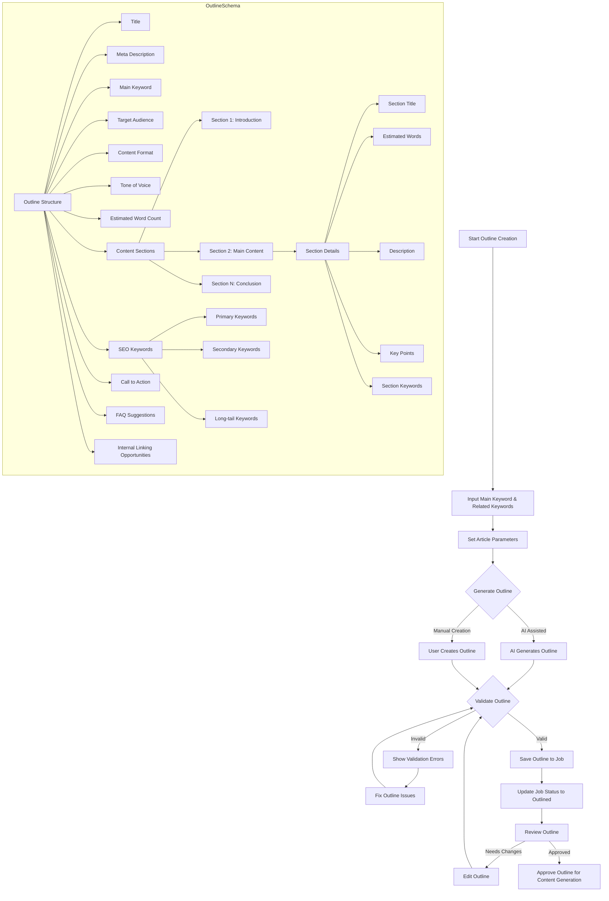
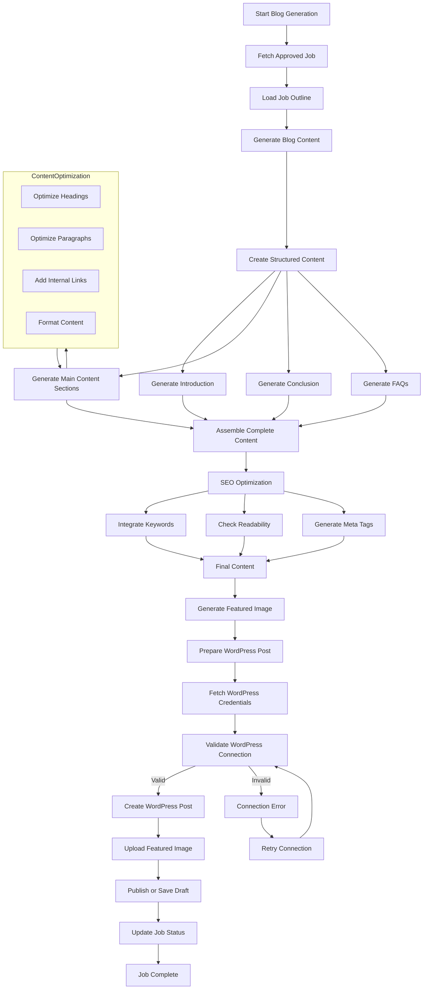
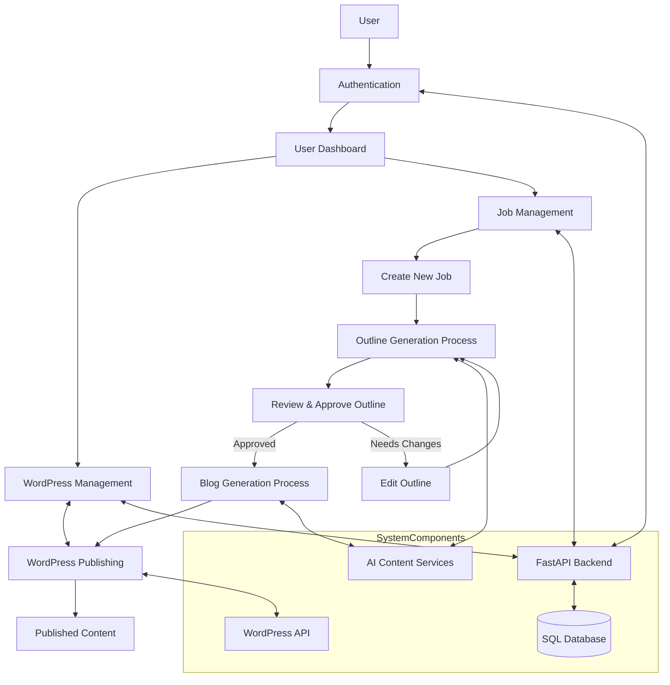

# Flow Diagrams for Blog Automation System

This document contains flow diagrams illustrating the architecture and processes of the blog automation system. The diagrams are created using Mermaid.js and cover three main categories:

1. API Flow and Authentication
2. Outline Generation Process
3. Blog Generation and WordPress Posting

## 1. API Flow and Authentication

This diagram illustrates the overall API architecture, including user authentication, WordPress integration, and job management.

## 2. Outline Generation Process

This diagram illustrates the process of generating and validating blog post outlines.

## 3. Blog Generation and WordPress Posting

This diagram illustrates the process of generating blog content from approved outlines and posting to WordPress.

## Combined System Overview

This diagram provides a high-level overview of how the three main components of the system interact.

